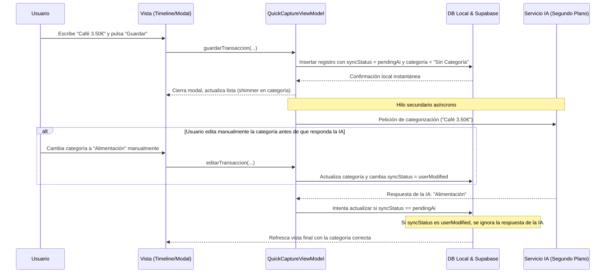

# Diseño de Arquitectura: Captura Rápida Asistida (Omnibox) - Zen OS

**Fecha:** 2026-06-25  
**Estado:** Propuesto / En Revisión  
**Autor:** Antigravity (Software Architect & PM)  

---

## 1. Visión de la Funcionalidad (UX/UI)

El Omnibox es el punto de entrada principal para la captura de datos en Zen OS, diseñado bajo la premisa de **Fricción Cero**.

### A. Modal Inicial (Selector Compacto)
*   Se despliega desde la parte inferior mediante el botón central `+`.
*   **Diseño:** Contenedor translúcido con efecto cristal ahumado (`BackdropFilter` con `ImageFilter.blur(sigmaX: 15, sigmaY: 15)`) sobre fondo `#2C2C2E` y borde reflectante de `0.5px` (gradiente blanco de opacidad `0.1` a `0.02`).
*   **Opciones:** Tres botones de gran tamaño y minimalistas con tipografía Inter (w600):
    *   `[ ☑️ Nueva Misión ]`
    *   `[ 💰 Registrar Gasto ]`
    *   `[ 📝 Apunte Rápido ]`

### B. Transición y Formulario Enfocado
*   Al seleccionar una opción (ej: Gasto), el modal realiza una transición animada suave (`AnimatedContainer` con física de muelle) hacia su estado expandido.
*   Los botones no seleccionados se desvanecen (`Opacity` a `0`), y el botón seleccionado se mueve hacia la cabecera del formulario.
*   El primer campo de texto se enfoca automáticamente y despliega el teclado del sistema de inmediato sin clics adicionales, usando un `FocusNode` coordinado.
*   **Campos por formulario:**
    *   **Misión:** Título (Focus) e indicador de Energía (por defecto `medium`).
    *   **Gasto:** Cantidad (Focus, teclado numérico) y Concepto (texto).
    *   **Apunte Rápido:** Contenido de la nota (Focus, Markdown libre).

### C. Clasificación Tacto-Directa (Fallback Sin IA)
*   **Transacciones (Categorías):** En el Timeline principal, tocar el icono de categoría abre un popover flotante (`overlay` de cristal ahumado) con una cuadrícula de categorías comunes. Seleccionar una actualiza el registro con feedback háptico.
*   **Misiones (Energía):** Tocar el indicador de tres barras en el Timeline rota cíclicamente el estado (`low -> medium -> high -> low`) al instante.

---

## 2. Arquitectura de Software (MVVM + Clean Architecture)

La implementación se dividirá estrictamente en las capas de Clean Architecture:

### A. Capa de Presentación (Presentation)
*   `QuickCaptureModal`: Widget de UI que renderiza los estados del modal, gestiona las animaciones de transición y los focos de teclado.
*   `QuickCaptureViewModel`:
    *   Maneja los estados de la captura (Cargando, FormularioActivo, Guardado).
    *   Valida los datos de entrada antes de enviarlos al caso de uso.
    *   Expone streams/notificadores para actualizar la UI sin acoplamiento.

### B. Capa de Dominio (Domain)
*   `SaveQuickCaptureUseCase`: Coordina el almacenamiento inmediato.
*   `TriggerAiRefinementUseCase`: Orquesta la llamada asíncrona a la IA para categorizar o etiquetar, sin bloquear el hilo principal.
*   Entidades afectadas: `Task`, `Transaction`, `Note`.

### C. Capa de Datos (Data)
*   `LocalDatabaseDataSource` (SQLite/Hive): Guarda el registro local al instante.
*   `SupabaseRemoteDataSource`: Sincroniza en segundo plano.
*   `AiRepository` / `AiService`: Encapsula las llamadas a Groq/OpenRouter.

---

## 3. Flujo Asíncrono de IA y Prevención de Errores de Estado

Para evitar condiciones de carrera (Race Conditions) y errores de estado cuando la IA tarda en responder o la conexión falla:

### Gestión de Fallos de Red y Clave API:
1.  **Validación de API Key:** El `AiService` verifica si la API Key está presente localmente (`AiService.isConfigured`). Si es `false`, el estado pasa automáticamente a `completed` sin realizar llamadas de red, dejando el resolvedor local determinista.
2.  **Fallback Local Determinista:** Si la IA está inactiva o el usuario está offline, la app busca en el histórico de transacciones si ya existe una descripción similar y copia su categoría.
3.  **Cola de reintentos:** Si la llamada a la IA falla por red, se encola en un Job Manager local con backoff exponencial.

---

## 4. Estrategia de Pruebas

*   **Pruebas Unitarias (Domain/Data):**
    *   Verificar que `SaveQuickCaptureUseCase` guarda en local de inmediato con estado `pendingAi`.
    *   Verificar que `TriggerAiRefinementUseCase` no sobrescribe transacciones marcadas como `userModified`.
    *   Probar el fallback local determinista ante la ausencia de API Key.
*   **Pruebas de Widget (Presentation):**
    *   Verificar que el modal inferior se abre y enfoca el input de texto en la transición del formulario.
    *   Comprobar que el popover contextual de categorías se despliega y actualiza la UI con 2 toques.
