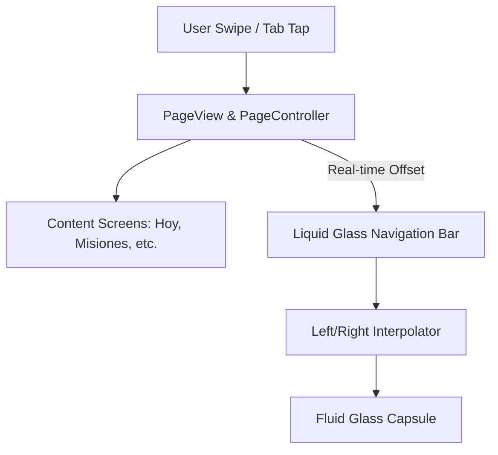
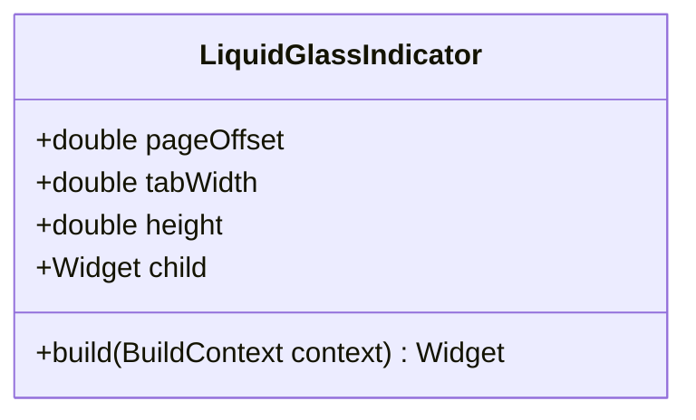

# Technical Design: Liquid Glass Navigation & Swipe Gestures

This document details the architectural and UI design to implement page-swiping transitions and a fluid "liquid glass" navigation bar on iOS for HeroOS (Zen OS).

---

## 1. System Architecture & Component Mapping

We are replacing the static screen-switching mechanism (`IndexedStack` triggered by tab taps) with a gesture-based, fluid navigation system driven by a `PageView` and a synchronized floating navigation bar.



### Components Changed/Created:
1. **`lib/presentation/screens/dashboard_screen.dart`**:
   - Replaces `IndexedStack` with `PageView` using a persistent `PageController`.
   - Modifies the `bottomNavigationBar` to render as a floating glassmorphic container (`style-floating` layout) containing a custom animated indicator.
2. **`lib/presentation/widgets/liquid_glass_indicator.dart`** (New Widget):
   - Handles the mathematical interpolation of the background capsule's boundaries to simulate organic fluid tension (stretching/contracting) during swipes.

---

## 2. Liquid Glass Animation Physics

To simulate realistic fluid tension (like gel or mercury stretching between tabs) in sync with the user's finger, we use a dual-edge interpolation technique driven directly by the `PageController` offset.

### The Algorithm:
For a transition from Page $i$ to Page $i+1$:
1. Let $t \in [0.0, 1.0]$ be the progress of the swipe.
2. The left edge of the indicator is driven by an **ease-in** curve:
   $$\text{Left} = (i + \text{easeIn}(t)) \times W_{\text{tab}}$$
3. The right edge of the indicator is driven by an **ease-out** curve:
   $$\text{Right} = (i + 1 + \text{easeOut}(t)) \times W_{\text{tab}}$$
4. The final dimensions are:
   - $\text{Position} = \text{Left}$
   - $\text{Width} = \text{Right} - \text{Left}$

This causes the right edge to accelerate first when moving right (stretching the capsule), and the left edge to catch up at the end (shrinking it back).



---

## 3. Implementation Details

### Floating Capsule Design System:
- **Material**: Glassmorphism using `BackdropFilter` (blur: 15.0), thin semitransparent borders (`white.withValues(alpha: 0.12)`), and drop shadows.
- **Floating behavior**: Positioned above the `Scaffold` body with a bottom padding safe-area margin to ensure it rests like an iOS dock.

```dart
// Conceptual snippet of the dynamic position math in Flutter
final double t = pageOffset - leftTab;
final double leftPos = (leftTab + Curves.easeIn.transform(t)) * tabWidth;
final double rightPos = (leftTab + 1 + Curves.easeOut.transform(t)) * tabWidth;
final double currentWidth = rightPos - leftPos;
```

---

## 4. Verification & Testing Plan

1. **Gesture Physics Verification**:
   - Test drag inertia and page snapping using native iOS scroll physics (`BouncingScrollPhysics`).
   - Validate that the stretching effect responds accurately to slow drags, fast swipes, and multi-tab leaps.
2. **Layout & Alignment**:
   - Verify alignment of text labels and indicators across multiple iPhone screen sizes (iPhone SE, Pro, Pro Max).
   - Ensure the horizontal scrolling of the navigation items remains functional and correctly shifts the viewport if a tab outside the viewport is selected.
3. **Performance Metrics**:
   - Confirm that updating the indicator offset does not trigger complete rebuilds of the underlying screen widgets. Optimize using `AnimatedBuilder` or `ValueNotifier`.
