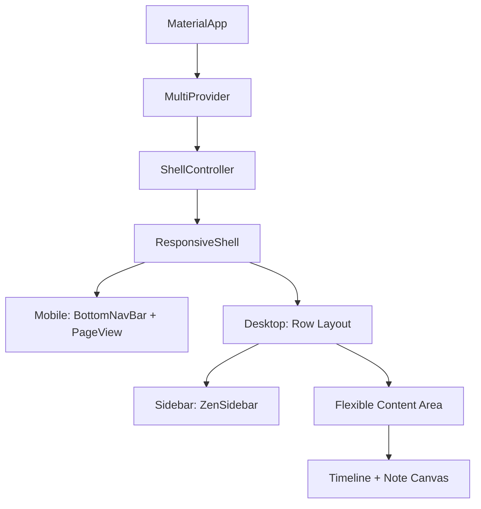

# Technical Design: Zen OS Responsive Shell & Multi-Panel Layout

**Date:** 2026-06-25  
**Status:** Proposed / Approved  
**Author:** Antigravity (Lead Software Architect & Designer)  

---

## 1. Vision & Architecture

Zen OS requires a unified, responsive "shell" that adaptively transitions between mobile and desktop configurations while preserving smooth gesture animations and maximizing user focus.

### Core Principles
- **Responsive Adaptability:** Automatic switching between a floating liquid bottom bar (mobile) and a persistent, collapsible sidebar (desktop).
- **Zen Focus (Modo Escritura):** Seamless hiding of navigation controls and secondary lists when the user begins writing, maximizing screen real estate.
- **Global Keyboard Command Access:** Access to the Quick Capture Omnibox from any view via standard system keyboard shortcuts.

### Component Mapping



---

## 2. State Management: ShellController

The UI-only presentation state is isolated from business viewmodels using a dedicated `ShellController` (ChangeNotifier).

```dart
import 'package:flutter/material.dart';

class ShellController extends ChangeNotifier {
  int _currentIndex = 0;
  bool _isWriting = false;
  bool _isSidebarCollapsed = false;

  int get currentIndex => _currentIndex;
  bool get isWriting => _isWriting;
  bool get isSidebarCollapsed => _isSidebarCollapsed;

  void setTab(int index) {
    if (_currentIndex == index) return;
    _currentIndex = index;
    notifyListeners();
  }

  void setWriting(bool writing) {
    if (_isWriting == writing) return;
    _isWriting = writing;
    notifyListeners();
  }

  void toggleSidebar() {
    _isSidebarCollapsed = !_isSidebarCollapsed;
    notifyListeners();
  }
}
```

---

## 3. Responsive Shell Implementation

### MultiProvider Setup (`lib/main.dart`)
Inject `ShellController` at the root provider tree:

```dart
ChangeNotifierProvider(create: (_) => ShellController()),
```

### ResponsiveShell Layout Builder (`lib/presentation/widgets/responsive_shell.dart`)
Manages structural layouts, layout animations, and keyboard shortcuts.

```dart
import 'package:flutter/material.dart';
import 'package:flutter/services.dart';
import 'package:provider/provider.dart';
import '../../core/theme/app_colors.dart';
import '../../core/utils/responsive.dart';
import '../viewmodels/shell_controller.dart';
import 'zen_sidebar.dart';

class ResponsiveShell extends StatelessWidget {
  final Widget child;

  const ResponsiveShell({super.key, required this.child});

  @override
  Widget build(BuildContext context) {
    final shell = context.watch<ShellController>();

    if (context.isWeb) {
      return Shortcuts(
        shortcuts: <LogicalKeySet, Intent>{
          LogicalKeySet(LogicalKeyboardKey.meta, LogicalKeyboardKey.keyK): const OmniboxIntent(),
          LogicalKeySet(LogicalKeyboardKey.meta, LogicalKeyboardKey.keyB): const ToggleSidebarIntent(),
        },
        child: Actions(
          actions: <Type, Action<Intent>>{
            OmniboxIntent: CallbackAction<OmniboxIntent>(
              onInvoke: (intent) => _triggerOmnibox(context),
            ),
            ToggleSidebarIntent: CallbackAction<ToggleSidebarIntent>(
              onInvoke: (intent) => shell.toggleSidebar(),
            ),
          },
          child: Focus(
            autofocus: true,
            child: Scaffold(
              backgroundColor: AppColors.scaffold,
              body: Row(
                children: [
                  AnimatedContainer(
                    duration: const Duration(milliseconds: 250),
                    curve: Curves.easeInOut,
                    width: shell.isWriting ? 0 : (shell.isSidebarCollapsed ? 64 : 240),
                    child: const ZenSidebar(),
                  ),
                  if (!shell.isWriting)
                    const VerticalDivider(width: 1, thickness: 1, color: AppColors.divider),
                  Expanded(
                    child: child,
                  ),
                ],
              ),
            ),
          ),
        ),
      );
    }

    return Scaffold(
      backgroundColor: AppColors.scaffold,
      body: child,
    );
  }

  void _triggerOmnibox(BuildContext context) {
    // Invocación del Omnibox Modal
  }
}

class OmniboxIntent extends Intent {
  const OmniboxIntent();
}

class ToggleSidebarIntent extends Intent {
  const ToggleSidebarIntent();
}
```

---

## 4. UI Components

### 1. ZenSidebar (`lib/presentation/widgets/zen_sidebar.dart`)
- **Background Color:** `#1C1C1E`
- **Border:** Thin vertical separator using `#2C2C2E` (or standard `AppColors.divider`).
- **Icons:** Linear, fine-weighted vector icons.
- **States:** Default opacity `0.4` transitioning smoothly to `0.9` during hover (`MouseRegion`).
- **Tooltips:** Standard native tooltip for each navigation point.

### 2. Collapsing Panels Interaction
Child modules like `NotesScreen` or `ZenCanvasScreen` listen to input focus. When the editor's text cursor focuses, it sets `isWriting = true` on the controller:
- Sidebar animates its width to `0`.
- The Timeline panel animates its width to `0`.
- The Note editor area dynamically expands to fill $100\%$ of the screen width.

---

## 5. Verification & Testing Plan

1. **Responsive Transition:**
   - Verify that resizing the browser width across the `kWebBreakpoint` (900.0) switches between `BottomNavigationBar` (mobile) and `ZenSidebar` (desktop) without losing current state.
2. **Focus Mode (Modo Escritura):**
   - Focus the main text editor. Verify that Sidebar and Timeline animate to `0` width and completely disappear.
   - Unfocus or press `Esc`. Verify that panels return to their standard widths.
3. **Keyboard Shortcuts:**
   - Press `Cmd + K`. Verify the Omnibox dialog appears centered.
   - Press `Cmd + B`. Verify the Sidebar toggles between collapsed (64px) and expanded (240px).
